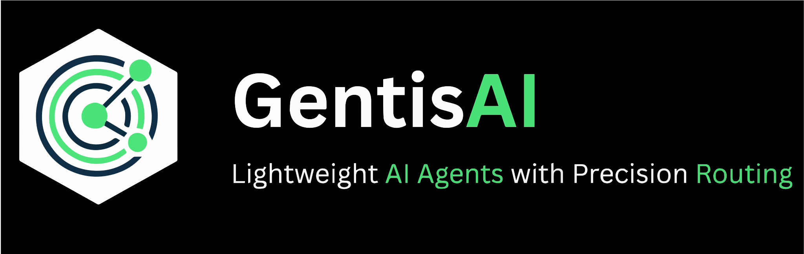

# Hi there, I'm Youssef Ghaoui 👋

## 🤖 AI Engineer | LLM Architect | Open Source Contributor | Top 1% AI practitioner on Zindi

I build **intelligent agentic systems** that plan, use tools, and coordinate multi-agent workflows. My work focuses on **RAG**, **fine-tuning**, **quantization**, and **orchestration** to deliver reliable, scalable AI solutions.

---

### 🚀 **New Release: GentisAI Framework**

    <picture>
      <source media="(prefers-color-scheme: light)" srcset=".github/imgs/GentisAI-B-banner-r.svg">
      <source media="(prefers-color-scheme: dark)" srcset=".github/imgs/GentisAI-B-banner-r.svg">
      
    </picture>

I recently released **[GentisAI](https://github.com/GhaouiYoussef/GentisAI)** (v0.1), a modular framework designed to streamline the development of intelligent agents and LLM applications.
> *Build intelligent agents and LLM apps faster with a scalable architecture.*

---

### 🛠️ **Tech Stack**

| Domain | Technologies |
| :--- | :--- |
| **AI & ML** | Python, PyTorch, TensorFlow, Hugging Face, LangChain, LlamaIndex |
| **LLMs & Agents** | OpenAI API, Ollama, Local LLMs, RAG, Q-LoRA, Fine-tuning |
| **Deployment** | Docker, Kubernetes, Azure, AWS, FastAPI, Flask |
| **Tools** | Git, VS Code, Jupyter, Postman, Linux |

---

### 🔭 **Featured Public Projects**

| Project | Description | Tech |
| :--- | :--- | :--- |
| **[GentisAI](https://github.com/GhaouiYoussef/GentisAI)** | 🌟 **New Framework** for building modular, scalable AI agents. | `Python` `AI Framework` |
| **[Ollama Recruiter Agent](https://github.com/GhaouiYoussef/Ollama-Local-Recruiter-Agent)** | Privacy-first local recruiter agent. Screens & ranks candidates on-device. | `Ollama` `Local LLM` |
| **[Lead Gen Expert](https://github.com/GhaouiYoussef/Lablab.ai-LeadGenerationExpert)** | Multi-agent debate system for lead qualification & scoring. | `IBM Granite` `Multi-Agent` |
| **[Auto-Investor](https://github.com/GhaouiYoussef/Auto-Investor)** | Automated crypto trading bot with statistical & neural forecasting. | `RNN` `BERT` `Binance API` |

---

### ✍️ **Latest Articles**

- [**The Impossible Tradeoff: Solving LLM Hallucination and Latency**](https://medium.com/@youssef.ghaoui/the-impossible-tradeoff-solving-llm-hallucination-and-latency-with-a-context-switching-router-8f4723b98c8f) - *Nov 2025*
- [**How to Stream Multimodal Outputs with Hugging Face Transformers**](https://medium.com/@youssef.ghaoui/how-to-stream-multimodal-outputs-with-hugging-face-transformers-bonus-gradio-integration-b7fcd80c191f) - *Dec 2024*

---

### 📊 **GitHub Stats**

  <!-- Trophies
  
    -->
  
  <!-- General Stats & Top Langs -->
  
  
  
  <!-- Streak Stats
   
   -->

---

### 📫 **Connect with Me**

  
  
  
  

